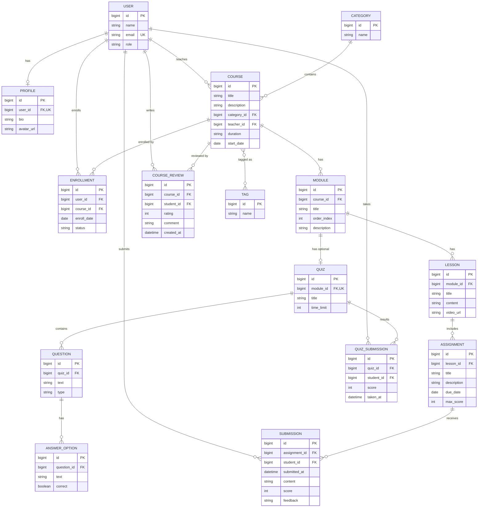

```mermaid
erDiagram

    USER {
        bigint id PK
        string name
        string email UK
        string role
    }

    PROFILE {
        bigint id PK
        bigint user_id FK,UK
        string bio
        string avatar_url
    }

    CATEGORY {
        bigint id PK
        string name
    }

    COURSE {
        bigint id PK
        string title
        string description
        bigint category_id FK
        bigint teacher_id FK
        string duration
        date start_date
    }

    ENROLLMENT {
        bigint id PK
        bigint user_id FK
        bigint course_id FK
        date enroll_date
        string status
    }

    MODULE {
        bigint id PK
        bigint course_id FK
        string title
        int order_index
        string description
    }

    LESSON {
        bigint id PK
        bigint module_id FK
        string title
        string content
        string video_url
    }

    ASSIGNMENT {
        bigint id PK
        bigint lesson_id FK
        string title
        string description
        date due_date
        int max_score
    }

    SUBMISSION {
        bigint id PK
        bigint assignment_id FK
        bigint student_id FK
        datetime submitted_at
        string content
        int score
        string feedback
    }

    QUIZ {
        bigint id PK
        bigint module_id FK,UK
        string title
        int time_limit
    }

    QUESTION {
        bigint id PK
        bigint quiz_id FK
        string text
        string type
    }

    ANSWER_OPTION {
        bigint id PK
        bigint question_id FK
        string text
        boolean correct
    }

    QUIZ_SUBMISSION {
        bigint id PK
        bigint quiz_id FK
        bigint student_id FK
        int score
        datetime taken_at
    }

    COURSE_REVIEW {
        bigint id PK
        bigint course_id FK
        bigint student_id FK
        int rating
        string comment
        datetime created_at
    }

    TAG {
        bigint id PK
        string name
    }

    %% ==== 1-1 ====
    USER ||--o| PROFILE : "has"
    MODULE ||--o| QUIZ : "has optional"

    %% ==== 1-M ====
    USER ||--o{ COURSE : "teaches"
    USER ||--o{ ENROLLMENT : "enrolls"
    USER ||--o{ SUBMISSION : "submits"
    USER ||--o{ QUIZ_SUBMISSION : "takes"
    USER ||--o{ COURSE_REVIEW : "writes"

    CATEGORY ||--o{ COURSE : "contains"

    COURSE ||--o{ MODULE : "has"
    COURSE ||--o{ ENROLLMENT : "enrolled by"
    COURSE ||--o{ COURSE_REVIEW : "reviewed by"

    MODULE ||--o{ LESSON : "has"

    LESSON ||--o{ ASSIGNMENT : "includes"

    ASSIGNMENT ||--o{ SUBMISSION : "receives"

    QUIZ ||--o{ QUESTION : "contains"
    QUIZ ||--o{ QUIZ_SUBMISSION : "results"

    QUESTION ||--o{ ANSWER_OPTION : "has"

    %% ==== M-M ====
    COURSE }o--o{ TAG : "tagged as"
```